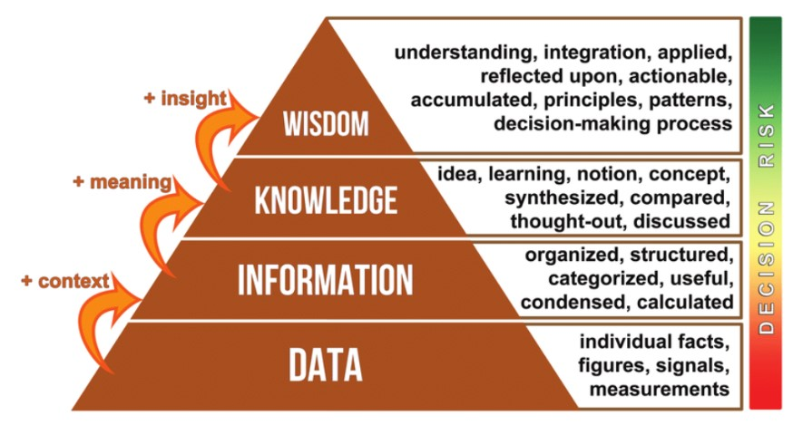
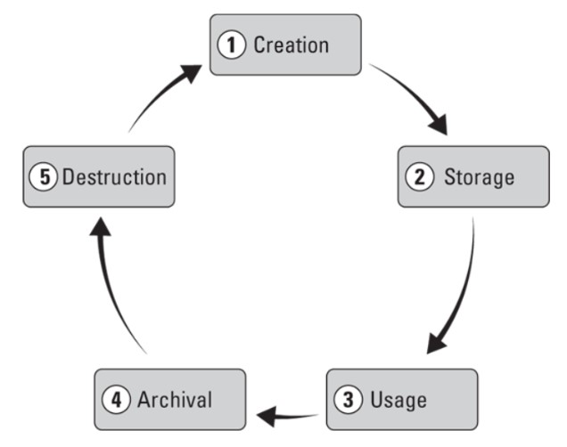
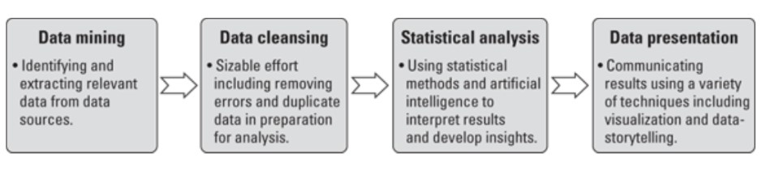
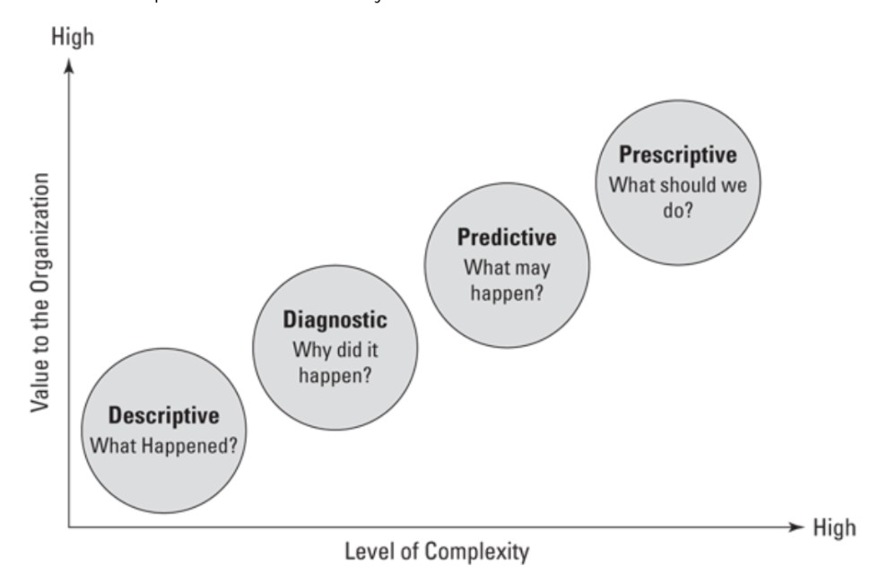

 # Data-Governance-Week-1

 Charpter 1 : Defining Data Governance 

 

What is meant by governance?

 

Governance oversees control and direction in a specific area.
It involves making, regulating, and enforcing decisions.
As entities grow, formal governance becomes vital to prevent chaos.

Governance exists in various contexts, from family rules to national laws.
Its formality varies based on context and purpose.

In data governance, the focus is on formalizing control, processes, and accountabilities to achieve specific results.
Different domains have their own governance systems tailored to their objectives.

Data governance is crucial due to the rapid growth of data and the need to manage associated risks.
Organizations seek to establish formal systems for data control and oversight to maximize data value while mitigating risks.

What is Data Governance?

 

Objective: Data governance is about managing data effectively to meet various needs.

Stakeholder Demands: Staff want quick access to accurate, high-quality data; leaders seek insights for informed decision-making; legal departments require compliance with laws; product designers need data for creative decisions; security professionals ensure data protection.

Business Demands: Quality management of data is essential for innovation, growth, and success.

Benefits: Well-managed data drives innovation, supports a data-driven culture, and improves outcomes.

Challenges: Many organizations aspire to be data-driven, but only a small percentage achieve this goal due to various barriers.

Risk Management: Successful data governance minimizes risks, ensures compliance, and provides comfort to business leaders.

Data Management Importance: Proper data management distinguishes organizations that value data as a valuable asset from those that don't.

Enterprise Information Management (EIM): EIM recognizes data as a valuable asset and involves governing and managing data as a central enabler.

Data Governance vs. Data Management: Data governance focuses on roles, policies, and the data lifecycle, while data management involves technical implementations like databases and analytics software

Developing a Data Governance Framework

 

Customization: Data governance programs must be tailored to each organization's needs, budget, and capabilities.

Framework Essentials: A data governance framework provides guiding concepts and structure for implementation.

Components: Common components include leadership and strategy, roles and responsibilities, policies, processes, standards, metrics, tools, and communications/collaboration.

Leadership and Strategy: Alignment with organizational strategy is crucial, requiring support and sponsorship from senior leadership.

Roles and Responsibilities: Identification and assignment of specific roles, recognizing that data governance involves nearly everyone in the organization.

Policies, Processes, and Standards: These guide responsibilities and ensure uniformity, requiring design, development, and enforcement with accountability.

Metrics: Measurement mechanisms are needed to assess program effectiveness and deliver value, facilitating continuous improvement.

Tools: Various tools support data governance and management, including those for master data management, security, integration, and compliance.

Communications and Collaboration: High-quality communication and collaboration are vital, requiring clear channels, change management, and a positive culture.

Preparing for Data Governance

 

Organizational Readiness: Before implementing data governance, organizations must assess their readiness, including their data culture.

Understanding Data Culture: Data culture refers to how an organization values, manages, and uses data. Mature data cultures prioritize data-driven decision-making and empower employees at all levels.

Significance of Data Culture: Effective data cultures enable informed decision-making based on data insights, fostering competitiveness and success in the digital age.

Leadership and Trust: Senior leadership plays a crucial role in fostering a data culture, emphasizing the importance of trust in data quality and understanding.

Assessment Process: Organizations can assess their data culture maturity through interviews, observations, and evaluation of decision-making processes.

Integration with Data Governance: Implementing data governance can enhance and contribute positively to building a robust data culture within an organization.

Maturing the Data Culture

 

Preparing for Data Governance: 

Before implementing data governance, organizations should focus on maturing their data culture.

Key Steps to Start:

Help leaders communicate the value of data and model data-driven behavior.
Provide basic tools and education for data use, including data manipulation, analytics, and visualization.
Show progress by starting with small, tangible initiatives.
Acknowledge resistance and frustration, and provide channels for feedback and discussion.

Assessing Readiness for Data Governance:

Ensure alignment with business strategy.
Secure full commitment from senior leadership.
Identify executive sponsors.
Establish long-term funding and commitment.
Understand that data governance is an ongoing program, not a one-off project.

Document the ROI.

Ensure legal and compliance support.
Verify the existence of fundamental data skills and IT support.
Ongoing Assessment: Continuously assess the organization's readiness for data governance throughout the planning and implementation process.

Chapter 2 : Exploring a World Overflowing with Data

 

Defining Data

 

Data is described as digitally stored units that gain meaning through processing, with examples of structured, unstructured, and semi-structured data provided. The value of data lies in its processing and application, which transforms it into useful information, driving various functions across industries. This processing, facilitated by information technology, forms the foundation of digital transformation

From Data to Insight

 

Creating, collecting, and storing data without a clear purpose is wasteful.

Exceptions exist, but generally, data should serve a purpose.

Unused data is as useless as unread reports; data must be converted into information to be meaningful.

Information organizes and contextualizes data, making it useful on its own.

Information, when coupled with broader concepts, becomes knowledge, which is actionable.

Knowledge, when combined with reasoning and experience, leads to wisdom.

Wisdom determines the contextual validity of knowledge and guides actions.

Insight, derived from knowledge and wisdom, provides a deeper understanding.

Examples illustrate the progression from data to insight using Harry Styles.

The data-information-knowledge-wisdom (DIKW) hierarchy depicts the journey from data to insight.

Data holds value in delivering wisdom but faces challenges in transformation.

Good data governance improves outcomes in data transformation and utilization.

The Role of Data in the 21st Century

 

Data has played pivotal roles throughout history, aiding in understanding the world, enhancing decision-making, and solving diverse problems. However, its value has skyrocketed in the 21st century due to technological advancements. Since the mid-20th century, with the rise of computer systems and the internet, data quantity, quality, and accessibility have surged. 

In the current era, data production exceeds our capacity to manage it, reshaping industries, cities, and even social dynamics. The profound impact of data extends to learning, socialization, and entertainment, while also introducing significant risks such as cyberattacks. With data being considered the most valuable asset today, we are undoubtedly in a new era defined by its influence.

Data-Driven Decision-Making

 

Data-driven decision-making harnesses the power of data to enhance decision quality across various contexts. From choosing a restaurant based on customer reviews to entering new markets with products or services, data guides informed choices. 

Rich datasets enable deeper understanding and facilitate confident decision-making, provided the data is of high quality. Data governance ensures data quality, underscoring its importance in effective decision-making.

Data as The New Oil

 

The metaphor of "data as the new oil" suggests that, like oil in the past, data is now driving and growing economies. Just as oil needed to be refined to be useful, data must be organized and analyzed to unlock its value. 

Just as oil powered industrial economies, data is powering digital economies today, with major companies like Facebook and Google leading the way. Industries across the board are being transformed by digitalization and data, with many leveraging data management to generate revenue. 

However, like oil, the control of vast amounts of valuable data confers significant power, raising concerns about privacy and monopolies similar to those seen with oil in the past.

Data Ownership

 
Data ownership describes the rights a person, team, or organization has over one or more data sets. These rights may span from lightweight oversight and control to rigorous rules that are legally enforceable. 

For example, data associated with intellectual property — items such as copyrights and trade secrets — will likely have high degrees of protection, from accessibility rights to who can use the data and for what purpose.

Data Architecture

 

Nearly every organization functions as a technology business today.

Enterprise Architecture (EA) aligns technical infrastructure with business strategy.

Data Architecture, a subset of EA, ensures data decisions align with business goals.

High-quality EA and data architectures facilitate smooth operations and adaptability.

Inadequate architectures can hinder digital efforts and increase complexity.

Data architecture involves ensuring data availability, simplifying access, enforcing protections, adopting standards, and optimizing data flow.

It reflects an organization's commitment to data governance and is a cross-organizational responsibility.

Efficient data flow across business silos is crucial for medium to large organizations.

The Lifecycle of Data

 

Creation:  This is the stage at which data comes into being. It may be manual or automated and get created internally or externally. Data is created all the time by a vast number of activities that include system inputs and outputs.

Storage:  Once data is created and assuming you want it available for later use, it must be stored. It most likely will be contained and managed in a database. The database needs a home, too as a local hard drive, server, or cloud service.

Usage:  Hopefully you’re capturing and storing data because you want to use it. Maybe not immediately, but at some point, perhaps for analysis. Data may need to be processed to be useful. That could include cleansing it of errors, transforming it to another format, and securing access rights.

Archival:  In this stage, you identify data that is not currently being used and move it to a long-term storage system out of your production environment. If it's needed at some point in the future, it can be retrieved and utilized.

Destruction:  Despite a desire by some to keep everything forever, there is a logical point where destruction makes sense or is required by regulation or policy. Data destruction involves making data inaccessible and unreadable. It can include the physical destruction of a device such as a hard drive.

Understanding the Impact of Big Data

 

Data isn’t some kind of new phenomenon. In fact, we’ve been capturing and storing data in an analog fashion for thousands of years. The Romans, for example, used ledgers to keep track of their various activities across their expansive empire.

Fast-forward to the 20th century and the Cold War was instrumental in the technological leaps that resulted in microprocessors and the classical computing we use today. 
One by-product of the Cold War, the space race between the United States and the Soviet Union, accelerated innovation in computing and telecommunications.

The U.S. Census played a crucial role in the development of data processing, originating in the late 1800s to tabulate population data every ten years.

The Tabulating Machine Company, later known as IBM, automated and commercialized data processing through punch cards, which represented data points like gender.

IBM's advancements in data processing expanded into various sectors, including office automation, military, academia, and factories.

These developments marked the transition into the information age, characterized by the proliferation of data as a raw material driving productivity and innovation.

Connectivity facilitated the free flow of information across devices, organizations, and geographies, leading to explosive growth in data creation, storage, and utilization.

The significant increase in data volume and velocity led to the emergence of "big data," reflecting the scale and challenge of managing vast amounts of data effectively.

Defining Big Data

 

One way to define and characterize big data is through these five Vs:

Volume: The sheer scale of data being produced is unprecedented and requires new tools, skills, and processes.

Variety: There are already a lot of legacy file formats, such as CSV and MP3, and with new innovations, new formats are emerging all the time. This requires different methods of handling, from analysis to security.

Velocity: With so many collection points, digital interfaces, and ubiquitous connectivity, data is being created and moved at increasing speed. Consider that in 2021, Instagram users created, uploaded, and share 65,000 pictures a minute.

Variability:  The fact that the creation and flow of data are unpredictable.

Veracity:  The quality, including accuracy and truthfulness, of large volume of disparate sets of data, can differ considerably, causing challenges to data management.

**Drivers of Big Data**

Big data has been a significant phenomenon preceding the era of smartphones and the Internet of Things (IoT), characterized by an explosion in data creation, storage, and utilization.

The volume of data has experienced exponential growth, with global technology use generating 79 zettabytes in 2021, expected to reach 180 zettabytes by 2025.

Despite its impressive scale, much of the data is unstructured, duplicative, or of poor quality, presenting challenges for analysis and accessibility.

Despite challenges, big data provides immense value to organizations, driving innovation and facilitating advancements like self-driving cars and optimized supply chains.

Big data enables organizations to make more informed decisions, especially in marketing, by targeting specific audiences and individuals effectively.

While big data receives significant attention, small data sets, such as spreadsheets and surveys, remain valuable for decision-making and daily operations.

Smart data has emerged as a term describing big data that has been optimized for specific uses, employing processes like artificial intelligence (AI) to extract relevant insights.

Data governance is essential for all forms of data, whether big, small, or smart, emphasizing the importance of managing data effectively in the 21st century.

 

Chapter 3 : Driving Value Through Data

 

Identify the Roles of Data

 

**Operations**: Data fuels day-to-day activities like payroll, order management, and marketing. It quantifies performance, facilitates decision-making, and supports internal and external communication.

**Strategy**: Data-driven strategies, developed through analysis and guided by principles, align with organizational goals and require operational support for implementation.

**Decision-Making**: Data enables better-informed decisions by providing real-time insights. Access to quality data at the right time is crucial, as bad data can lead to failure.

**Measuring**: Organizations continuously measure various aspects, using quantitative or qualitative data to inform decisions. However, not everything that counts can be counted, highlighting the importance of meaningful data collection.

**Monitoring**: Continuous evaluation of processes, systems, or projects involves collecting data to ensure performance, stability, and reliability. Data quality monitoring is essential for timely identification of issues.

**Insight Management**: Data analysis leads to actionable insights, which must be communicated effectively to relevant stakeholders. Knowledge management supports insight availability across the organization.

**Reporting**: Reports, containing structured data and information, aid in decision-making and problem-solving. The purpose of reporting is to empower leaders with timely and relevant information.

Approaching Data as an Asset

 
An asset is something that is owned by a person, an organization, or a government with the expectation that it can bring some economic benefit. This includes the generation of income, the reduction of expenses, or an increase in net worth.

An asset can be tangible or intangible. Tangible assets are physical things.
An intangible asset is the opposite, it’s a non-physical thing. Data is an intangible asset.

Improves operations.

Increases existing revenue.

Produces new forms of revenue.

Builds relationships with customers and other stakeholders.

Improves the quality of products and services.

Contributes to competitive advantage.

Enables innovation.

Reduces risk.

Data Analytics

 

Raw data indeed lacks meaningful insights on its own. To extract value, it requires the application of specialized tools and techniques, a process known as data analytics. This formal and disciplined approach is conducted by data analysts to derive answers or conclusions from data sets, aiding in decision-making for individuals or organizations.

The process of data analytics typically involves several steps, which vary depending on available resources and the context. These steps generally begin after the identification of the problem and questions to be addressed

**Descriptive**:  Existing data sets of historical data are accessed, and analysis is performed to determine what the data tells stakeholders about the performance of a key performance indicator (KPI) or other business objectives. It is insight on past performance.

**Diagnostic**:  As the term suggests, this analysis tries to glean from the data the answer to why something happened. It takes descriptive analysis and looks at the cause.

**Predictive**:  In this approach, the analyst uses techniques to determine what may occur in the future. It applies tools and techniques to historical data and trends to predict the likelihood of certain outcomes.

**Prescriptive**:  This analysis focuses on what action should be taken. In combination with predictive analytics, prescriptive techniques provide estimates of the probabilities of a variety of future outcomes.

Data Management

 
Definition: Data management involves the implementation of strategies and processes to handle organizational data effectively.

Role: It ensures that data is collected, stored, organized, maintained, and analyzed to maximize its value and quality.

Importance: Good data management leads to enhanced organizational performance by providing richer insights, smoother operations, and informed decision-making.

*Components*:

Collection: Gathering of data.

Storage: Storing data securely.

Organization: Structuring data for easy access and use.

Maintenance: Regular updates and management of data.

Analytics: Extracting insights from data.

Responsibilities: Technology teams play a crucial role, but all business stakeholders have responsibilities, including compliance with data policies and realizing data value.

Impact: Well-executed data management results in reduced security breaches, compliance issues, and higher confidence in data quality.

**Governing Data**

Definition: Governing data involves establishing controls and policies to manage and protect organizational data.

Purpose: It ensures adherence to policies, reduces risks, and maximizes data value.

*Essential Factors*:

People: Subject matter experts responsible for data quality and overseeing processes.

Policies: Adopted rules regarding data handling, including quality, privacy, retention, and security.

Metrics: Measurements to assess policy adherence and effectiveness, guiding both technical and business needs.

 

 